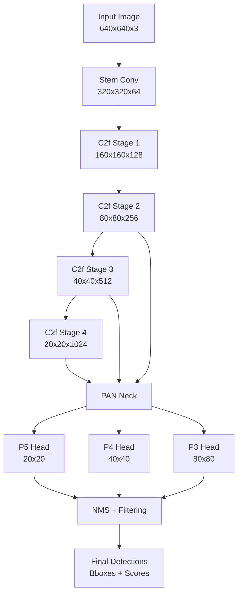
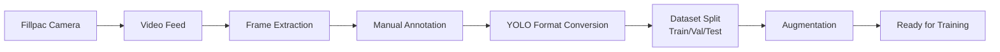
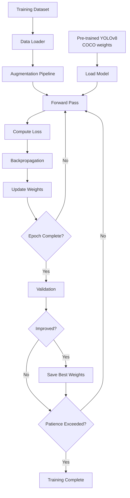
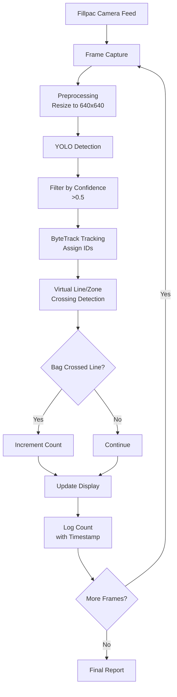
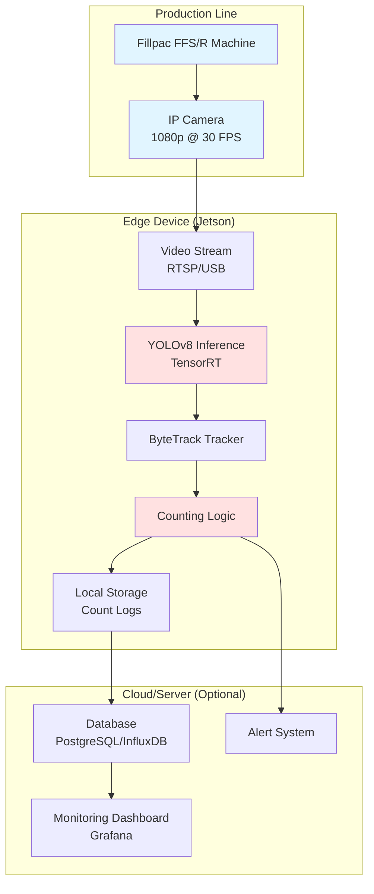

# YOLO Bag Counting Model Architecture

## Overview

This document provides a detailed technical description of the YOLOv8-based bag counting system architecture for BEUMER Fillpac machines.

## Model Architecture: YOLOv8

### High-Level Structure

YOLOv8 (You Only Look Once version 8) is a single-stage object detector that processes images in one forward pass through a convolutional neural network. The architecture consists of three main components:

```
Input Image (640x640) → Backbone → Neck → Head → Predictions (Bboxes + Classes + Scores)
```

### Detailed Components

#### 1. Backbone: CSPDarknet with C2f Modules

**Purpose**: Extract hierarchical features from input images

**Structure**:
- **Input Layer**: 640x640x3 RGB image
- **Stem**: Initial convolution (3x3, stride 2) → 320x320x64
- **Stage 1**: C2f block → 160x160x128
- **Stage 2**: C2f block → 80x80x256
- **Stage 3**: C2f block → 40x40x512
- **Stage 4**: C2f block → 20x20x1024

**C2f Module** (CSP Bottleneck with 2 Convolutions):
- Cross Stage Partial (CSP) connections for gradient flow
- Bottleneck layers with residual connections
- Reduces parameters while maintaining accuracy
- Prevents vanishing gradients in deep networks

**Why it matters for Fillpac**:
- Multi-scale features capture bags at different distances
- Residual connections help detect bags in challenging conditions (dust, occlusions)
- Efficient computation for real-time processing

#### 2. Neck: Path Aggregation Network (PAN)

**Purpose**: Fuse features from different scales for multi-scale detection

**Structure**:
- **Bottom-up pathway**: Combines low-level (fine details) and high-level (semantic) features
- **Top-down pathway**: Propagates strong semantic features to lower layers
- **Lateral connections**: Merge features at each scale

**Feature Pyramid Levels**:
- P3 (80x80): Detects small bags (far from camera)
- P4 (40x40): Detects medium bags (mid-range)
- P5 (20x20): Detects large bags (close to camera)

**Why it matters for Fillpac**:
- Handles varying bag sizes on conveyor
- Detects bags at different positions (near/far)
- Robust to scale variations in PE film vs. valve bags

#### 3. Head: Detection Layers

**Purpose**: Generate final predictions for bounding boxes and classes

**Structure**:
- **Decoupled head**: Separate branches for classification and regression
- **Classification branch**: Predicts class probabilities (in our case, single class: "bag")
- **Regression branch**: Predicts bounding box coordinates (x, y, w, h)
- **Objectness score**: Confidence that an object exists

**Output Format** (per detection):
```
[x_center, y_center, width, height, confidence, class_probability]
```

**Post-processing**:
- **Non-Maximum Suppression (NMS)**: Remove duplicate detections (IoU threshold: 0.45)
- **Confidence filtering**: Keep detections above threshold (default: 0.5)
- **Class filtering**: Only "bag" class (class ID: 0)

**Why it matters for Fillpac**:
- Decoupled head improves accuracy for single-class detection
- NMS prevents double-counting overlapping bags
- Confidence threshold filters false positives (e.g., conveyor parts, dust)

### Architecture Diagram



### Model Variants for Fillpac

| Variant | Parameters | FLOPs | Speed (FPS) | mAP | Use Case |
|---------|-----------|-------|-------------|-----|----------|
| YOLOv8n | 3.2M | 8.7G | 80+ | ~0.85 | Edge devices (Jetson Nano), real-time |
| YOLOv8s | 11.2M | 28.6G | 60+ | ~0.88 | Balanced (Jetson Xavier) |
| YOLOv8m | 25.9M | 78.9G | 40+ | ~0.91 | High accuracy (GPU server) |
| YOLOv8l | 43.7M | 165.2G | 30+ | ~0.93 | Maximum accuracy (cloud) |

**Recommendation**: Start with YOLOv8n for prototyping, upgrade to YOLOv8m if accuracy insufficient.

---

## End-to-End Pipeline Flow

### 1. Data Collection & Preparation



**Key Steps**:
- **Frame Extraction**: Extract 1 frame per second from Fillpac videos (30 FPS → 1 FPS)
- **Annotation**: Label bags with bounding boxes using Roboflow/LabelImg
- **YOLO Format**: Convert to normalized (x_center, y_center, width, height)
- **Split**: 80% train, 10% val, 10% test
- **Augmentation**: Apply industrial-specific transforms (dust, lighting, blur)

### 2. Model Training



**Training Process**:
- **Initialization**: Load pre-trained COCO weights (transfer learning)
- **Fine-tuning**: Train on Fillpac bag dataset (50-100 epochs)
- **Loss Function**: Combination of:
  - Classification loss (Binary Cross-Entropy)
  - Localization loss (CIoU - Complete IoU)
  - Objectness loss (Binary Cross-Entropy)
- **Optimizer**: AdamW with learning rate 0.001
- **Early Stopping**: Patience of 20 epochs (stop if no improvement)

**Validation Metrics**:
- **mAP@0.5**: Mean Average Precision at IoU 0.5 (target: >0.85)
- **Precision**: True positives / (True positives + False positives)
- **Recall**: True positives / (True positives + False negatives)

### 3. Inference & Counting (Production)



**Inference Steps**:

1. **Frame Capture**: Read frame from video/camera (30 FPS)
2. **Preprocessing**: Resize to 640x640, normalize pixel values
3. **Detection**: Run YOLO forward pass (~20-50ms on GPU)
4. **Filtering**: Keep detections with confidence >0.5
5. **Tracking**: ByteTrack assigns unique IDs to each bag
6. **Counting**: 
   - **Line Mode**: Count when bag centroid crosses virtual line
   - **Zone Mode**: Count when bag enters/exits defined zone
7. **Logging**: Record count with timestamp every second
8. **Display**: Annotate frame with bboxes, IDs, and count

**ByteTrack Tracking**:
- Associates detections across frames using Kalman filter
- Handles occlusions and missed detections
- Prevents double-counting when bags overlap
- Maintains unique ID for each bag throughout video

### 4. Deployment Architecture



**Deployment Options**:

**Option 1: Edge Deployment (Recommended)**
- **Hardware**: NVIDIA Jetson Xavier NX or Orin Nano
- **Model**: YOLOv8n exported to TensorRT (.engine)
- **Advantages**: Low latency, no network dependency, real-time
- **Setup**:
  ```bash
  # Export to TensorRT
  yolo export model=best.pt format=engine device=0
  
  # Run on Jetson
  python inference_video.py --weights best.engine --source rtsp://camera-ip
  ```

**Option 2: Cloud Deployment**
- **Hardware**: GPU instance (AWS EC2 P3, Azure NC series)
- **Model**: YOLOv8m/l for higher accuracy
- **Advantages**: Centralized monitoring, easier updates
- **Disadvantages**: Network latency, bandwidth costs

**Option 3: Hybrid**
- Edge for real-time counting
- Cloud for analytics and long-term storage

---

## Counting Logic Details

### Line Crossing Method

**Setup**:
- Define horizontal line at 60% of frame height (adjustable)
- Line represents conveyor exit point

**Algorithm**:
```python
for each tracked_bag:
    current_y = bag.centroid.y
    previous_y = bag.previous_centroid.y
    
    if previous_y < line_y and current_y >= line_y:
        count += 1  # Bag crossed from top to bottom
```

**Advantages**:
- Simple and reliable
- Works well for single-direction conveyors
- Low computational overhead

**Disadvantages**:
- Requires consistent bag movement direction
- May miss bags if tracking lost at line

### Zone Entry/Exit Method

**Setup**:
- Define rectangular zone (e.g., bottom 40% of frame)
- Zone represents counting area

**Algorithm**:
```python
for each tracked_bag:
    currently_in_zone = bag.centroid in zone
    previously_in_zone = bag.previous_centroid in zone
    
    if not previously_in_zone and currently_in_zone:
        count += 1  # Bag entered zone
```

**Advantages**:
- More robust to tracking errors
- Can count in both directions
- Better for complex conveyor layouts

**Disadvantages**:
- Slightly higher computation
- Requires larger zone for accuracy

---

## Performance Optimization

### For Training
- **Mixed Precision (AMP)**: 2x faster training with minimal accuracy loss
- **Batch Size**: Maximize based on GPU memory (16-32 typical)
- **Workers**: Use 8+ data loader workers for CPU preprocessing
- **Cache**: Cache images in RAM if dataset fits (faster epochs)

### For Inference
- **TensorRT Export**: 2-3x speedup on NVIDIA GPUs
- **ONNX Export**: Cross-platform optimization
- **Batch Inference**: Process multiple frames together (if latency allows)
- **Resolution**: Use 416x416 instead of 640x640 for speed (slight accuracy drop)

### For Counting
- **ROI Processing**: Only run YOLO on region of interest (conveyor area)
- **Frame Skipping**: Process every 2nd frame if FPS too low
- **Tracker Tuning**: Adjust ByteTrack parameters for speed/accuracy trade-off

---

## Handling Fillpac-Specific Challenges

### Challenge 1: Dust and Poor Lighting
**Solution**:
- Augment training data with brightness/contrast variations
- Apply CLAHE (Contrast Limited Adaptive Histogram Equalization) preprocessing
- Use higher confidence threshold to reduce false positives

### Challenge 2: High Speed (2,600 bags/hour = 43 bags/min)
**Solution**:
- Use YOLOv8n for maximum FPS (80+)
- Deploy on edge GPU (Jetson Xavier)
- Optimize tracking parameters for fast-moving objects

### Challenge 3: Overlapping Bags
**Solution**:
- Train with augmented overlapping scenarios
- Use NMS with lower IoU threshold (0.3-0.4)
- ByteTrack handles temporary occlusions

### Challenge 4: Varying Bag Types (PE film vs. Valve bags)
**Solution**:
- Include diverse bag types in training dataset
- Consider multi-class model if counting separately needed
- Augment with scale variations

---

## Integration with Fillpac Systems

### Real-time Monitoring
- Display YOLO count alongside Fillpac machine counter
- Alert if discrepancy >5% (potential jam or quality issue)

### Production Reporting
- Log counts to database with timestamps
- Generate hourly/daily reports
- Compare with production targets (e.g., 2,600 bags/hour)

### Quality Control
- Flag frames with low confidence detections for review
- Identify anomalies (e.g., damaged bags, irregular shapes)

---

## References

- [YOLOv8 Architecture Paper](https://arxiv.org/abs/2305.09972)
- [Ultralytics Documentation](https://docs.ultralytics.com)
- [ByteTrack Paper](https://arxiv.org/abs/2110.06864)
- [BEUMER Fillpac Specifications](https://www.beumergroup.com)
